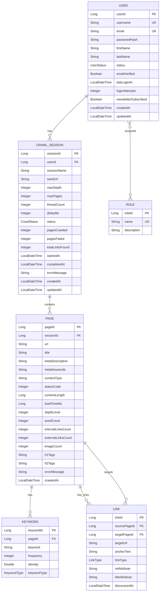

# 🧠 Project Data Model Documentation – CrawlForge

This document describes the entities, their attributes, relationships, and core use cases in the CrawlForge web crawler project.

---

## 📦 1. Entity Details and Relationships

### 1.1. `User` Entity

**Table Name:** `users`  
Represents a system user.

#### Fields:

- `userId (PK)` – Auto-generated.
- `username` *(UK)* – Unique username.
- `email` *(UK)* – Unique email.
- `firstName`, `lastName` – User’s name.
- `passwordHash` – Secure hashed password.
- `status` *(Enum: ACTIVE, SUSPENDED, INACTIVE)* – Current user state.
- `emailVerified` *(Boolean)* – Email confirmation status.
- `lastLoginAt` *(Timestamp)* – Last login time.
- `loginAttempts` – Count of failed attempts.
- `newsletterSubscribed` *(Boolean)*
- `createdAt`, `updatedAt` – Auditing timestamps.

#### Relationships:

- `One-to-Many` with **CrawlSession** (a user can have multiple sessions).
- `Many-to-Many` with **Role** via `user_roles` table.

#### Business Methods:

- `getFullName()`
- `isActive()`
- `canLogin()`
- `incrementLoginAttempts()`
- `resetLoginAttempts()`
- `hasRole(String roleName)`
- `isAdmin()`

---

### 1.2. `Role` Entity

**Table Name:** `roles`  
Defines roles for users (e.g., ADMIN, USER).

#### Fields:

- `roleId (PK)`
- `name (UK)`
- `description`

#### Relationships:

- `Many-to-Many` with **User**

---

### 1.3. `CrawlSession` Entity

**Table Name:** `crawl_sessions`  
Represents a crawling session initiated by a user.

#### Fields:

- `sessionId (PK)`
- `user (FK)`
- `sessionName`
- `seedUrl`
- `maxDepth`, `maxPages`
- `threadCount`, `delayMs`
- `status` *(Enum: PENDING, RUNNING, etc.)*
- `pagesCrawled`, `pagesFailed`, `totalLinksFound`
- `startedAt`, `completedAt`, `errorMessage`
- `createdAt`, `updatedAt`

#### Relationships:

- `Many-to-One` with **User**
- `One-to-Many` with **Page**

#### Business Methods:

- `isActive()`
- `canResume()`
- `getSuccessRate()`

---

### 1.4. `Page` Entity

**Table Name:** `pages`  
Represents a single web page discovered during a crawl.

#### Fields:

- `pageId (PK)`
- `crawlSession (FK)`
- `url` *(per session uniqueness assumed)*
- `title`, `metaDescription`, `metaKeywords`
- `contentType`, `statusCode`
- `contentLength`, `loadTimeMs`, `depthLevel`
- `wordCount`, `internalLinksCount`, `externalLinksCount`
- `imageCount`
- `h1Tags`, `h2Tags`
- `errorMessage`, `crawledAt`

#### Relationships:

- `Many-to-One` with **CrawlSession**
- `One-to-Many` with **Link** (incoming & outgoing)
- `One-to-Many` with **Keyword**

#### Business Methods:

- `isSuccessful()`, `isRedirect()`, `isError()`
- `getDomain()`

---

### 1.5. `Link` Entity

**Table Name:** `links`  
Represents a hyperlink on a page.

#### Fields:

- `linkId (PK)`
- `sourcePage (FK)`
- `targetPage (FK)` *(nullable if not crawled/internal)*
- `targetUrl`, `anchorText`
- `linkType` *(Enum: INTERNAL, EXTERNAL, etc.)*
- `relAttribute`, `titleAttribute`
- `discoveredAt`

#### Relationships:

- `Many-to-One` with **Page** (source and optional target)

---

### 1.6. `Keyword` Entity

**Table Name:** `keywords`  
Represents an extracted keyword from a page.

#### Fields:

- `keywordId (PK)`
- `page (FK)`
- `keyword`, `frequency`, `density`
- `keywordType` *(Enum: TITLE, META, CONTENT, etc.)*

#### Relationships:

- `Many-to-One` with **Page**

---

## 🔧 2. Core Use Cases

### 2.1. User Management

- **Register:** Create new user, assign role.
- **Login:** Validate, update lastLoginAt, handle loginAttempts.
- **Profile Update:** Edit user details.
- **Role Assignment:** Admin adds/removes roles.

### 2.2. Crawl Session Management

- **Create/Start/Pause/Resume/Cancel** crawl sessions.
- **Track Progress** using pagesCrawled and errors.

### 2.3. Crawled Data Analysis

- View crawled **pages**, **links**, **keywords**.
- Generate **crawl reports**, analyze **SEO data**, **link structure**.

### 2.4. Admin Panel

- Create, update, and delete user roles.
- Moderate crawl behavior or failures.

---

## 📐 3. Business Logic & Rules

- **Login Restrictions:** Max 5 failed attempts → SUSPENDED.
- **Status transitions:** PENDING → RUNNING → COMPLETED/FAILED/PAUSED
- **Keyword Density:** `(frequency / totalWords) * 100`
- **Link Categorization:**
    - `INTERNAL`: Same domain
    - `EXTERNAL`: Different domain
    - `MAILTO`, `JAVASCRIPT`, `ANCHOR`: Special types
- **Timestamps**: `createdAt`, `updatedAt` auto-managed by JPA

---

## 🚀 4. Future Enhancements

- Scheduled/recurring crawls
- Sitemap generation
- Broken link tracker
- Change detection across crawls
- REST API support
- Message queue/distributed crawling

---

## 🧩 5. Entity Relationship Diagram (Mermaid)

