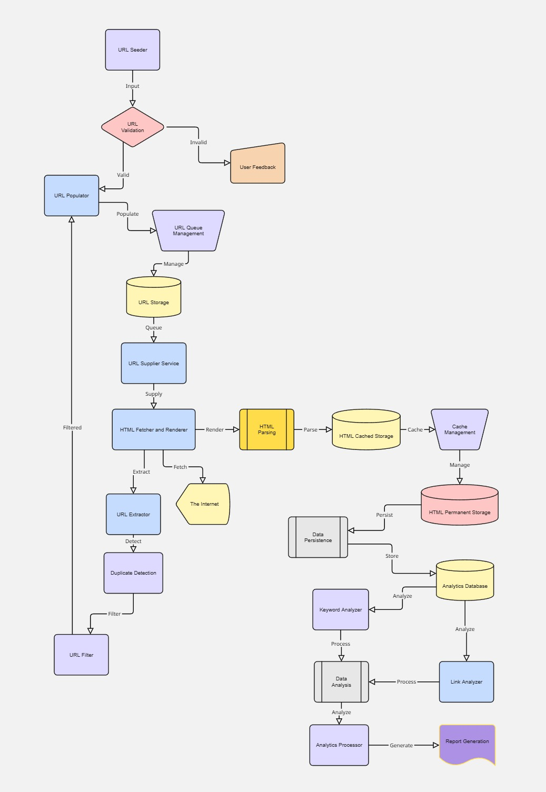
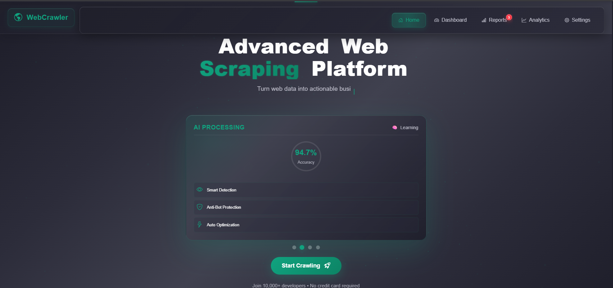
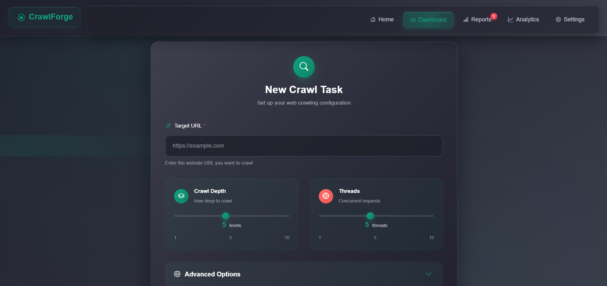

# 🌐 WebCrawler_Analytics



> **Smart. Scalable. Search-Driven.**  
> WebCrawler_Analytics is a robust Java Servlet + JSP-based application that performs intelligent crawling, real-time analytics, and content indexing at scale.

---

## 🧩 System Architecture Diagram – Components Overview

### 🟦 URL MANAGEMENT
- **URL Seeder** → Initial URL input processing
- **URL Populator** → Validation and deduplication  
- **Seen URL Storage** → Tracks processed URLs (Database)
- **URL Storage** → Queue of URLs to process (Database)
- **URL Supplier Service** → Thread-safe URL distribution

### 🟨 FETCH AND RENDER
- **HTML Fetcher and Renderer** → Multi-threaded content retrieval
- **The Internet** → External data source target

### 🧩 URL ORCHESTRATION
- **URL Extractor** → Link discovery from HTML content
- **Duplicate Detection** → Hash-based URL deduplication  
- **URL Filter** → Domain, depth, and pattern filtering

### 🟩 STORAGE
- **SharedDB Analytics** → Processed metrics and reports
- **HTML Permanent Storage** → MySQL database persistence
- **HTML Cached Storage** → In-memory caching with LRU eviction

---

## 🔄 Data Flow Architecture

### Primary Crawling Flow
1. **URL Seeder** → **URL Populator** (Initial processing)
2. **URL Populator** → **Seen URL Storage** (Duplicate check)
3. **URL Populator** → **URL Storage** (Queue management)
4. **URL Storage** → **URL Supplier Service** (URL distribution)
5. **URL Supplier Service** → **HTML Fetcher and Renderer** (Content retrieval)
6. **HTML Fetcher and Renderer** ↔ **The Internet** (HTTP requests)
7. **HTML Fetcher and Renderer** → **HTML Cached Storage** (Temporary storage)
8. **HTML Fetcher and Renderer** → **HTML Permanent Storage** (Persistent storage)

### URL Orchestration Loop
9. **HTML Fetcher and Renderer** → **URL Extractor** (Link discovery)
10. **URL Extractor** → **Duplicate Detection** (Deduplication)
11. **Duplicate Detection** → **URL Filter** (Filtering)
12. **URL Filter** → **URL Populator** (Loop back for new URLs)

### Analytics Flow
- **HTML Permanent Storage** → **SharedDB Analytics** (Data processing)
- **SharedDB Analytics** → Dashboard and reporting systems

---

## 🧱 Project Structure

```
WebCrawler_Analytics/
│
├── src/
│   ├── controller/
│   ├── service/
│   ├── dao/
│   ├── model/
│   └── utils/
│
├── web/
│   ├── index.jsp
│   ├── css/
│   └── js/
│
├── resources/
│   └── crawler.properties
├── pom.xml
└── README.md
```

---

## 🎨 UI Color Palette (Scrapy-inspired)

| Element         | Color Code  | Notes                          |
|----------------|-------------|--------------------------------|
| Primary Accent  | `#10a37f`   | Vibrant green for buttons/icons |
| Background      | `#1f1f2b`   | Hero/primary dark section       |
| Section BG      | `#2b2c39`   | Alternating sections            |
| Card BG         | `#40414f`   | Panel containers                |
| Text (Primary)  | `#ffffff`   | Base white text                 |
| Text (Muted)    | `#c5c5d2`   | Subheadings, form labels        |
| Border Soft     | `#5c5f6e`   | Inputs, outlines                |

---

## 📐 CSS Utility Classes

```css
/* Text & Colors */
.text-white     { color: #ffffff; }
.text-muted     { color: #c5c5d2; }
.text-primary   { color: #10a37f; }

/* Backgrounds */
.bg-dark        { background-color: #1f1f2b; }
.bg-section     { background-color: #2b2c39; }
.bg-card        { background-color: #40414f; }
.bg-hero        { background: linear-gradient(to right, #1f1f2b, #2c2c3a); }

/* Borders & Rounding */
.border-soft    { border: 1px solid #5c5f6e; }
.rounded-2xl    { border-radius: 16px; }

/* Spacing & Layout */
.p-4            { padding: 1rem; }
.px-5           { padding-left: 3rem; padding-right: 3rem; }
.my-5           { margin-top: 3rem; margin-bottom: 3rem; }
.mx-auto        { margin-left: auto; margin-right: auto; }
.flex-center    { display: flex; justify-content: center; align-items: center; }

/* Hero Section */
.hero-title     { font-size: 2.5rem; font-weight: 700; color: #10a37f; }
.hero-subtitle  { font-size: 1.25rem; color: #c5c5d2; }

/* Buttons */
.btn {
  background-color: #10a37f;
  color: white;
  border: none;
  padding: 0.6rem 1.4rem;
  border-radius: 8px;
  font-weight: 500;
  text-transform: uppercase;
  letter-spacing: 0.5px;
  transition: background-color 0.3s ease;
}
.btn:hover {
  background-color: #0d8465;
}

/* Cards */
.card-glass {
  background-color: rgba(64, 65, 79, 0.92);
  backdrop-filter: blur(6px);
  border: 1px solid #5c5f6e;
  border-radius: 12px;
  padding: 1.5rem;
}
```

---

## ⚙️ Tech Stack

| Layer       | Technology              |
|------------|--------------------------|
| UI         | JSP + Bootstrap 5        |
| Backend    | Servlet, Java 21         |
| Crawler    | JSoup + Multithreading   |
| DB         | MySQL + JDBC             |
| Design     | MVC + DAO + Service Layer|
| Tools      | Maven, IntelliJ, Git     |

---

## 📈 Features Overview

- ✅ Java OOP + Threads + Interfaces
- 🔁 Real-time URL queue management
- 🧠 HTML parsing + keyword extraction
- 🕸️ JSoup crawler engine
- 📊 Database + Cache analytics
- 🛠️ Retry logic, duplicate detection
- 📡 Real-time dashboard integration ready

---

## 🧠 Why This Project Matters

This project is designed to help **2+ year Java developers** demonstrate:

- Servlet lifecycle & MVC structure
- JDBC integration with DAO
- JSoup parsing & crawler logic
- Multi-threading in real-world scenario
- Modern UI with Bootstrap 5
- Database-first development using MySQL

---

## 📸 Coming Soon

- ✅ UI Screenshots-




- ✅ Dashboard mockup
- ✅ Logs page


---

## 👨‍💻 Author

**Ashish Kumar Jha**  
_Java Developer | System Architect | UI Enthusiast_

---

## 📄 License

MIT — Use freely, learn deeply, contribute proudly.
